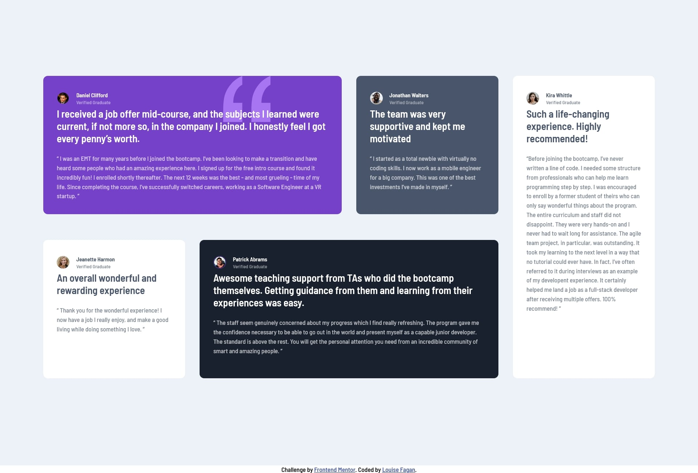

# Frontend Mentor - Testimonials grid section solution

This is a solution to the [Testimonials grid section challenge on Frontend Mentor](https://www.frontendmentor.io/challenges/testimonials-grid-section-Nnw6J7Un7). Frontend Mentor challenges help you improve your coding skills by building realistic projects.

## Table of contents

- [Overview](#overview)
  - [The challenge](#the-challenge)
  - [Screenshot](#screenshot)
  - [Links](#links)
- [My process](#my-process)
  - [Built with](#built-with)
  - [What I learned](#what-i-learned)
  - [Continued development](#continued-development)

## Overview

Front End Mentor Challenge Testimonials grid section using grid layout.

### The challenge

Users should be able to:

- View the optimal layout for the site depending on their device's screen size

### Screenshot

### Links

- Solution URL: [https://github.com/LouFagan/testimonials-grid-section-main.loufagan.github.io]
- Live Site URL: [https://loufagan.github.io/testimonials-grid-section-main.loufagan.github.io/]

## My process

First I tried to create the page full width first and it didn't work very well so then I started over using mobile first and I think I was better able to get the page to transition better from mobile to full width.

### Built with

- Semantic HTML5 markup
- CSS custom properties
- Flexbox
- CSS Grid
- Mobile-first workflow

### What I learned

Every project that I tackle I find that I learn more about grid, flexbox and css in general. I enjoyed building this project.

### Continued development

I will keep focusing on flexbox, grid and try to not learn more so that I don't have to use media queries to make the pages.
